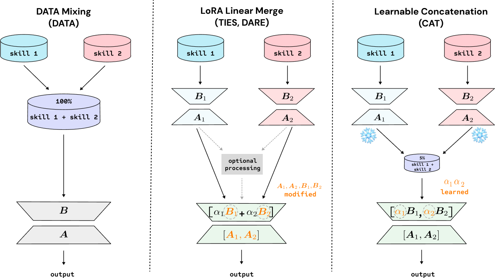

# LoRA-Soups

Code implementation and data for the paper:

**[LoRA Soups: Merging LoRAs for Practical Skill Composition Tasks](https://arxiv.org/abs/2410.13025)**

[Akshara Prabhakar](https://aksh555.github.io/), Yuanzhi Li, Karthik Narasimhan, Sham Kakade, Eran Malach, Samy Jelassi



## Quickstart

> **Notes**
> * CAT is implemented on top of PEFT `version 0.6.0`
> * MoE is tested using [mergoo](https://github.com/Leeroo-AI/mergoo) that requires a higher PEFT version (use a different environment to test)

```bash
pip install -r requirements.txt
```

Store all environments variables in a `.env` file
```bash
HF_TOKEN=...
TRANSFORMERS_CACHE=...
HF_DATASETS_CACHE=...
HF_HOME=...
WANDB_API_KEY=...
```

### Skill LoRA
To train a skill LoRA
```bash
bash train_skill.sh
```

To evaluate skill LoRA
```bash
bash eval_skill.sh
```

### Learnable Concatenation (CAT)
To train CAT
```bash
bash train_cat.sh
```

To evaluate CAT and other methods (TIES, DARE)
```bash
bash eval_cat.sh
```

## Citation
If you find this work useful, please consider citing:
```
@misc{prabhakar2024lorasoupsmergingloras,
      title={LoRA Soups: Merging LoRAs for Practical Skill Composition Tasks}, 
      author={Akshara Prabhakar and Yuanzhi Li and Karthik Narasimhan and Sham Kakade and Eran Malach and Samy Jelassi},
      year={2024},
      eprint={2410.13025},
      archivePrefix={arXiv},
      primaryClass={cs.CL},
      url={https://arxiv.org/abs/2410.13025}
}
```

## Credits
- LoRA fine-tuning code is adapted from [LLM-Adapters](https://github.com/AGI-Edgerunners/LLM-Adapters)
- CAT is built over [PEFT](https://github.com/huggingface/peft)